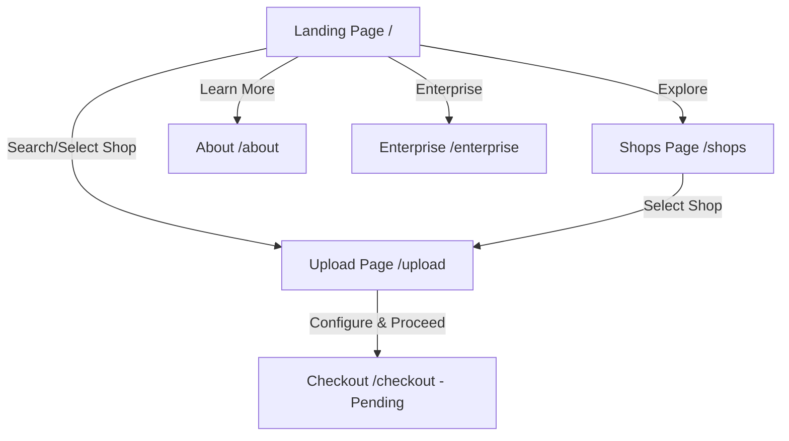

# Project Flow Analysis: PrintEasy (XerService)

This document outlines the architecture, user journey, and technical flow of the PrintEasy platform.

## 🏗 Architecture Overview
The project is transitioning to a full-stack application:
- **Frontend**: React 18 (Vite, TS, Tailwind, Shadcn UI)
- **Backend**: FastAPI (Python)
- **Database**: SQLite (Storing files as BLOBs)
- **Payments**: Razorpay Integration
- **State Management**: TanStack Query (Frontend) / SQLAlchemy (Backend)

---

## 🚀 User Journey Flow

### 1. Landing & Discovery
- **Entry Point**: `Index.tsx`
- **Actions**:
  - User lands on the hero section.
  - Searches for their location via `LocationSearch`.
  - Views "How It Works" and "App Promo".
  - **Shop Selection**: Nearby shops (dynamic from FastAPI) are displayed.

### 2. Shop Browsing
- **Page**: `ShopsPage.tsx`
- **Actions**:
  - Browse a full list of available xerox shops.
  - Filter by distance, rating, and availability.

### 3. Document Upload & Configuration
- **Page**: `UploadPage.tsx`
- **Actions**:
  - `FileUploader`: Files are sent to FastAPI `/upload` endpoint.
  - `PrintSettings`: Configuration is saved to the backend.

### 4. Checkout & Payment
- **Transition**: Uses Razorpay to process payments.
- **Logic**: Upon successful payment, the shop receives the document.
- **Security**: Files deleted after 16 hours.

---

## 🛠 Technical Flow & Data Handling

### File Management (FastAPI + SQLite)
- **Storage**: Files are stored directly in SQLite as `BLOB` data.
- **Preview**: FastAPI serves file data with appropriate headers for browser previews.
- **Cleanup**: A background task or cron job removes records older than 16 hours.

### Navigation Logic

### Key Components Hierarchy
- `App.tsx` (Router & Query Client)
  - `Layout` (Header/Footer)
    - `UploadPage`
      - `FileUploader` (react-dropzone)
      - `FileList`
      - `PrintSettings`
    - `ShopsPage`
      - `ShopCard`

---

## 📝 Observations & Next Steps
- **Supabase Integration**: While mentioned in requirements, the current codebase lacks direct `@supabase/supabase-js` references. Implementation of the Storage bucket and auto-delete logic (16-hour TTL) is the logical next step.
- **Checkout Page**: The route exists in logic but the component/page is not yet registered in `App.tsx`.
- **Backend Sync**: Data is currently static (mock data); transition to a real database (Supabase/PostgreSQL) will involve replacing `mockShops` with TanStack Query hooks.
